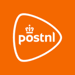

<p align="center">
  
</p>

<h1 align="center">PostNL for Home Assistant</h1>

<p align="center">
  Bring <strong>Mijn Post</strong>, <strong>Mijn Pakketten</strong>, <strong>Mijn Bezorging</strong> and <strong>Reis van je pakket</strong> into Home Assistant, including scanned mail items and dedicated PostNL Lovelace cards.
</p>

<p align="center">
  
  
  
</p>

---

## Features

- Sign in directly with your PostNL **e-mail address and password** (no browser extension needed). The Chrome Login Helper remains available as a fallback.
- **Mijn Post** with scanned mail-item images.
- **Mijn Pakketten** with Track & Trace enrichment: weight, dimensions, full status history, PostNL observation codes, a normalised package phase and PostNL Point information.
- Sensors for counts, package status, package phase, delivery date, delivery window, sender, receiver, tracking information, weight (kg), dimensions (cm), PostNL Point and last update.
- Binary sensors for expected mail, delivered parcels, PostNL Point delivery and connection status.
- Manual **Refresh** button and `postnl_lrvdlinden.refresh` action.
- Home Assistant events for new mail, new parcels, status changes, new Track & Trace events, delivered parcels, delivery windows (known/changed), weight and dimensions becoming known, sync errors and expired login sessions.
- Old, already delivered parcels that re-appear in the PostNL feed never trigger "new parcel" or "delivered" events.
- Four built-in Lovelace cards:
  - **Mijn Post**
  - **Mijn Pakketten** (detail popup now includes weight, dimensions, PostNL Point and a Track & Trace link)
  - **Mijn Bezorging**
  - **Reis van je pakket** (new)
- Local PostNL branding for the Home Assistant integration picker and device/service UI.
- **Mijn Bezorging** follows the original PostNL widget layout, delivery timeline and animated delivery van concept.

Mail-item scans are not stored in the recorder as large base64 attributes. The Lovelace cards retrieve them through an authenticated Home Assistant WebSocket command.

## Installing via HACS

1. Open **HACS → Integrations**.
2. Add `LRvdLinden/nl.lrvdlinden.postnl-ha` as a custom repository of type **Integration**.
3. Install **PostNL for Home Assistant**.
4. Restart Home Assistant.
5. Go to **Settings → Devices & services → Add Integration → PostNL**.

The Lovelace module is served and registered automatically by the integration. A separate `/config/www/postnl` folder or manually configured dashboard resource is not required.

## Linking your PostNL account

### Option 1 – e-mail and password (recommended)

1. Go to **Settings → Devices & services → Add integration → PostNL**.
2. Choose **Sign in with e-mail and password**.
3. Enter the same e-mail address and password you use on jouw.postnl.nl.

Your password is only used for the sign-in itself. Home Assistant stores the resulting PostNL tokens, never your password. When the session expires, Home Assistant asks you to sign in again via a repair notification.

### Option 2 – Chrome Login Helper (fallback)

Use this if the direct sign-in does not work for your account (for example when PostNL asks for an extra verification step).

1. [**Download the PostNL Home Assistant Login Helper**](https://github.com/LRvdLinden/nl.lrvdlinden.postnl-ha/raw/main/tools/PostNL-Home-Assistant-Login-Helper.zip) and extract the ZIP file.
2. Open `chrome://extensions`, enable **Developer mode**, and select **Load unpacked**.
3. Select the extracted helper folder.
4. In Home Assistant, add the PostNL integration and choose **Sign in with the Chrome Login Helper**.
5. Open the PostNL sign-in URL shown by Home Assistant and sign in to your PostNL account.
6. The helper captures the `postnl://login?...` callback automatically. Click the extension icon and choose **Copy callback**.
7. Return to Home Assistant, paste the callback into the PostNL setup form and complete the sign-in process.

Passwords, callbacks, authorization codes and tokens are not written to Home Assistant logs.

## Lovelace cards

The cards are loaded automatically and appear in the dashboard card picker. YAML configuration is also supported.

### Mijn Post

```yaml
type: custom:postnl-mail-card
```

### Mijn Pakketten

```yaml
type: custom:postnl-packages-card
```

### Mijn Bezorging

```yaml
type: custom:postnl-delivery-card
```

### Reis van je pakket

The full Track & Trace timeline of your active parcel, including weight, dimensions and PostNL Point.

```yaml
type: custom:postnl-journey-card
# optional: maximum height of the scrollable timeline in pixels (default 420)
height: 420
```

## Entities

| Entity | Description |
| --- | --- |
| `sensor.mijn_postnl_mail_items` | Number of mail items (attribute `items` feeds the Mijn Post card) |
| `sensor.mijn_postnl_packages` | Parcels on the way (attributes `items`, `active_package`, `journey_package` feed the cards) |
| `sensor.mijn_postnl_package_status` | Official PostNL status text of the active parcel |
| `sensor.mijn_postnl_package_phase` | Normalised phase: `registered`, `in_transit`, `out_for_delivery`, `at_pickup_point`, `delivered`, `returning`, `unknown` (attribute `status_history`) |
| `sensor.mijn_postnl_package_weight` | Weight in kg |
| `sensor.mijn_postnl_package_dimensions` | Dimensions as text, e.g. `42 x 31 x 18 cm` |
| `sensor.mijn_postnl_package_length/width/height` | Separate dimensions in cm (disabled by default) |
| `sensor.mijn_postnl_postnl_status_code` | Latest PostNL observation code (disabled by default) |
| `sensor.mijn_postnl_postnl_point` | PostNL Point name when delivered to a pick-up point |
| `binary_sensor.mijn_postnl_*` | Mail expected, parcel delivered, PostNL Point delivery, connected |

Entity IDs can differ slightly depending on your Home Assistant language.

## Events

All events include `entry_id`; parcel events include `tracking`, `sender`, `receiver`, `status`, `canonical_status`, `observation_code`, `event`, `delivery_date`, `delivery_window`, `weight_kg`, `dimensions`, `pickup_point` and more.

| Event | When |
| --- | --- |
| `postnl_new_mail` | A new mail item is announced |
| `postnl_new_package` | A new (not yet delivered) parcel appears |
| `postnl_delivery_window_known` | A delivery window becomes known |
| `postnl_delivery_window_changed` | The delivery window changes (`old_delivery_window`) |
| `postnl_package_event_changed` | A new Track & Trace event (`old_event`) |
| `postnl_package_status_changed` | The PostNL status changes (`old_status`) |
| `postnl_package_delivered` | A parcel goes from active to delivered |
| `postnl_package_weight_known` / `postnl_package_dimensions_known` | Weight or dimensions become available |
| `postnl_sync_failed` / `postnl_login_expired` | Sync error or expired login |

```yaml
automation:
  - alias: PostNL – pakket bezorgd
    triggers:
      - trigger: event
        event_type: postnl_package_delivered
    actions:
      - action: notify.notify
        data:
          message: "Je pakket van {{ trigger.event.data.sender }} is bezorgd."
```

## Manual installation

Copy `custom_components/postnl_lrvdlinden` to `/config/custom_components/postnl_lrvdlinden`, restart Home Assistant and add **PostNL** from **Settings → Devices & services**.

## Compatibility

Minimum Home Assistant version: **2026.6.0**.

The PostNL interfaces used by this integration are not publicly documented and may be changed by PostNL at any time.

---

## Contribution

If you appreciate this integration, you can support future development via [PayPal, iDEAL or Bunq.me](https://lrvdlinden.app/donate.html). Your support helps keep development moving. ✨🚀
